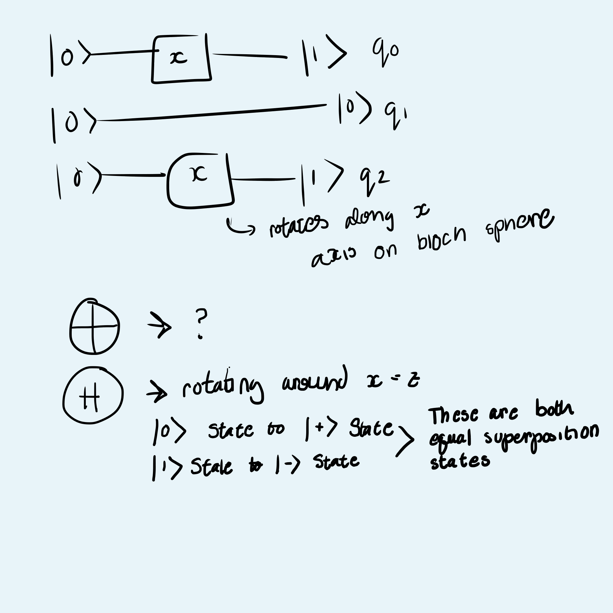

## Hackathon Information
Quackhacks 2025 is a quantum computing hackathon for beginners hosted by the NC State Quantum Computing Club. 

## Tutorial Notes
These notes are from the presentation given at the start of the hackathon. 
### Classical Information 
* Presented in bits, which can only be on or off (binary numbers)
* Important for prompt: converting decimal to binary
### Classical Information vs Quantum Information 
* Classical: 101 = 5
* Quantum: 00(1|0) = 001 or 000 
    * The last bit can be 0 or 1 (superposition)
* |Superposition State> = a |000> + b |001>
    * a = b = sqrt(1/2) (The probability of measuring that state is the coefficient squared)
    * A state is denoted by |State>
### Preparing These "Superposition" States using Quantum Computing

